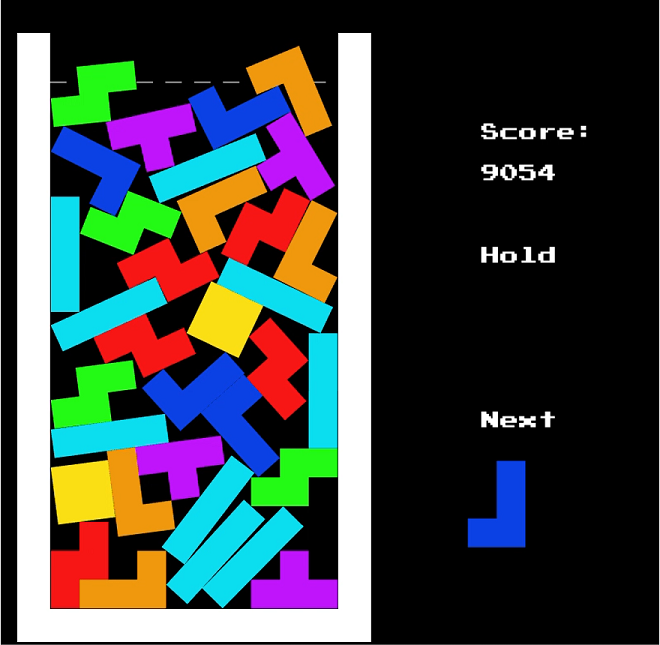
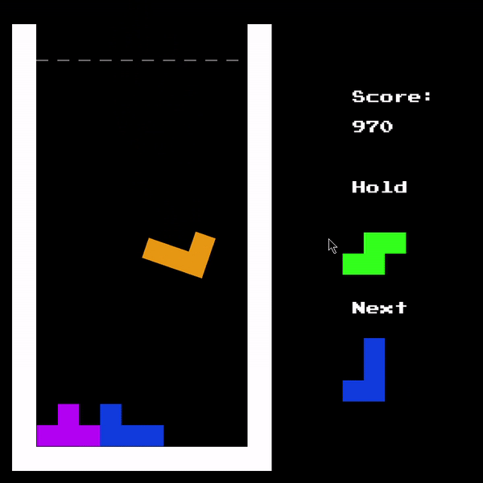

# Tetris but Harder - CS126 Final Project

Read [this document](https://cliutils.gitlab.io/modern-cmake/chapters/basics/structure.html) to understand the project
layout.

**Author**: Daniel Huang - [`dthuang3@illinois.edu`](mailto:dthuang3@illinois.edu)

* [Overview](#overview)
* [Setup](#setup)
* [Playing the game](#playing-the-game)
    * [Controls](#controls)

### Overview
Tetris but Harder is a game modeled after the original Tetris tile-matching game by Alexey Pajitnov. It includes the
basic concepts of the game as adapted by Nintendo as well as a entirely physics-based world. The game pieces move left,
right, and rotate according to the laws of physics/mechanics. This program primarily uses the [Cinder] creative coding
library and the [Box2D] physics engine.

### Setup
* [Cinder]
* [Box2D]
* [Visual Studio 2015]

[Cinder]: https://libcinder.org
[Box2D]: https://box2d.org
[Visual Studio 2015]: https://my.visualstudio.com/Downloads?q=visual%20studio%202015&wt.mc_id=o~msft~vscom~older-downloads

Tetris but Harder requires these three dependencies to work properly, you can download them at their respective links.
More information about using CMake for external libraries can be found [here][1]. More information about installing Cinder
can be found under part 0 [here][2]. Cinder requires Visual Studio 2015 to work properly, so make sure to set the 
toolchain for your environment to Visual Studio 14.0. 

After installation, you can clone this repo into: `~/Cinder/my-projects`.
Keep in mind that the `CMakeLists.txt` of the Cinder library will be inside `~/Cinder`, which is two directories above
the project location (`../../`).

[1]: https://courses.grainger.illinois.edu/cs126/sp2020/notes/cmake/
[2]: https://courses.grainger.illinois.edu/cs126/sp2020/assignments/snake/

### Playing the game

The goal of the game is to stay alive as long as possible and earn points by clearing lines. Don't rage quit!

#### Controls
The game has six main controls: left, right, down, Z, C, and shift.

Key | Action
:---: | ---
Left | [&#8592;] Pushes the game piece to the left.
Right | [&#8594;] Pushes the game piece to the right
Down | [ &#8595; ] Pushes the game piece downwards (aka Soft Drop)
Z | [ Z ] Rotates the game piece counter-clockwise around the center of mass
C | [ C ] Rotates the game piece clockwise around the center of mass 
RShift | [Shift] Holds the current piece
 
You can clear lines by lining up 10 blocks on the bottom row.

### Code Style
Code follows the [Google C++ Style Guide](https://google.github.io/styleguide/cppguide.html). Some discrepancies may
occur from the usage of external libraries.